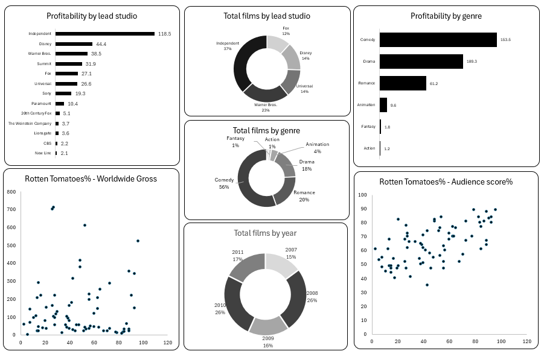

# Hollywood-Data-Analysis-Project

This project focuses on analyzing Hollywood movie data using **Microsoft Excel** and creating an interactive **dashboard** to uncover key insights about profitability, film production, and audience reception.

---

## 📊 Project Overview
The goal of this project was to explore Hollywood film industry data and identify patterns across **studios, genres, years, and audience ratings**.  
Using Excel, the dataset was cleaned, transformed, and visualized with charts and dashboards to provide actionable insights.

---

## 📂 Dashboard Sheets
The project includes the following sheets and visualizations:

- **Profitability by Lead Studio** – Analyzes profitability performance across leading studios.  
- **Profitability by Genre** – Compares profitability trends across different genres.  
- **Total Films by Lead Studio** – Displays the number of films produced by major studios.  
- **Total Films by Genre** – Shows how many films belong to each genre.  
- **Total Films by Year** – Examines film production trends over time.  
- **Rotten Tomatoes % - Worldwide Gross** – Correlation between critic scores and worldwide box office gross.  
- **Rotten Tomatoes % - Audience Score vs Director** – Comparison of audience scores across directors.  

---

## ⚙️ Tools & Techniques
- **Microsoft Excel**  
  - Data Cleaning  
  - Pivot Tables  
  - Charts (Bar, Column, Line)  
  - Conditional Formatting  
  - Dashboard Design  

---

## 📸 Dashboard Preview

*(Replace `screenshot.png` with your actual dashboard image file.)*

---

## 🚀 Key Insights
- Certain studios consistently outperform others in terms of profitability.  
- Genre-based profitability varies significantly, with some genres showing strong ROI.  
- Audience and critic ratings do not always align with box office performance.  
- Film production volumes have fluctuated over the years, highlighting industry trends.  

---

## 📌 Conclusion
This Excel-based project demonstrates how **business intelligence techniques** can be applied to entertainment industry data. By leveraging dashboards, stakeholders can quickly evaluate profitability, production trends, and audience reception.

---

## 🔗 Future Improvements
- Expand dataset with more recent Hollywood releases.  
- Add advanced Excel features like slicers and timelines for dynamic filtering.  
- Build a Power BI or Tableau version for deeper interactivity.  
