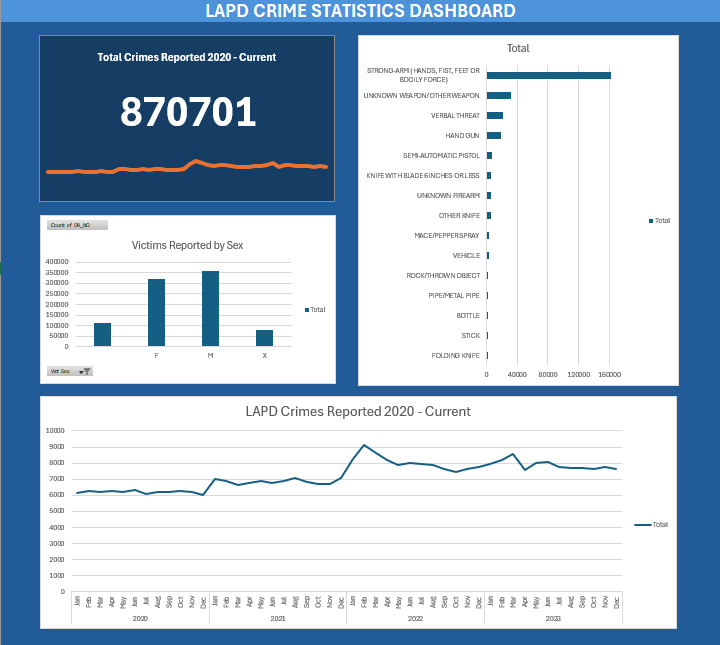

# 🚔 LAPD Crime Statistics Dashboard (Excel Data Analysis Project)

This project presents an interactive Excel dashboard that analyzes crime statistics reported by the Los Angeles Police Department from **2020 to the present**.

Using Excel's powerful data transformation and visualization tools such as **Power Query**, **Pivot Tables**, and **Charts**, this project provides insights into total crimes reported, victim demographics, and overall trends over time.

---

## 🖼️ Dashboard Preview

---

## 📥 Download the Excel Dashboard

You can download and explore the Excel file with all visualizations and transformations included:

🔗 [Download Excel File (Google Drive)](https://docs.google.com/spreadsheets/d/1w9C3QF535XZL80qZIaS2KCfUYKVGPz3V/edit?usp=sharing&ouid=104624069575803203894&rtpof=true&sd=true)

> ⚠️ After opening the file, go to `Data > Refresh All` to update Power Query connections.

---

## 📊 Dashboard Highlights

The dashboard consists of the following key components:

- 📈 **Total Crimes Reported (2020 - Current)**  
  Overview of the total number of crimes reported each year since 2020.

- 👥 **Victims Reported by Sex**  
  Breakdown of victims by gender to identify any demographic trends in crime victimization.

- 🗺️ **LAPD Crimes Reported (2020 - Current)**  
  A timeline visual showing the number of crimes per year, allowing comparison across time.

- 🔢 **Overall Total Summary**  
  Displays the total number of incidents recorded in the dataset.

---

## 🧰 Tools & Techniques Used

- **Excel Power Query**  
  - Cleaned and transformed raw LAPD crime data  
  - Removed null values, filtered relevant years (2020–current)  
  - Created dynamic tables for dashboard

- **Pivot Tables & Pivot Charts**  
  - Aggregated data by year and sex  
  - Built interactive visualizations

- **Slicers and Filters**  
  - Enabled user-driven exploration of data (e.g., by year or crime type)

- **Data Validation and Named Ranges**  
  - Ensured dashboard integrity and user-friendly interactions

---

---

## 📌 Key Insights

- There was a visible change in total reported crimes from 2020 onwards, likely influenced by societal and pandemic-related factors.
- Gender-based analysis reveals consistent patterns in victim demographics.
- Overall crime trends can be tracked effectively using Excel’s timeline visualizations.

---

## 📜 License

This project is for educational and portfolio purposes. Data belongs to LAPD and City of Los Angeles Open Data Portal.

---

## 🙋‍♂️ About Me

I'm a data analyst passionate about turning raw data into compelling visual stories using tools like Excel, Power BI, Python, and SQL.

Connect with me on [LinkedIn](https://www.linkedin.com/in/giray-sengonul-168420318/) or explore more on my [GitHub](https://github.com/giraysengonul).
