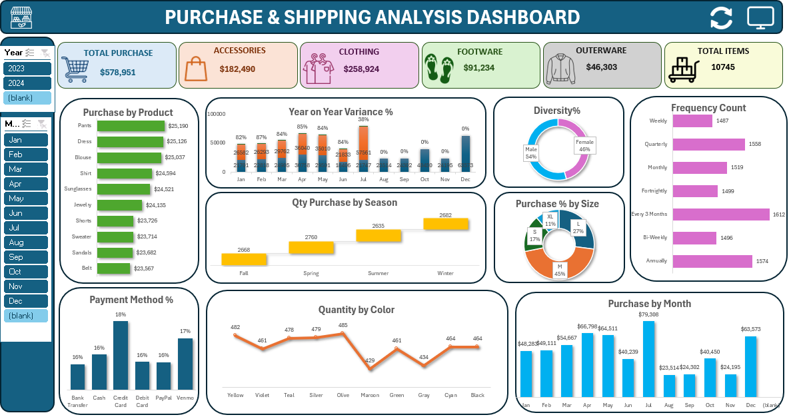

# Purchase & Shipping Analysis Project

This project focuses on analyzing purchasing behavior and shipping trends using Excel. It includes advanced data analysis techniques such as pivot tables, calculated fields, dashboards, and interactive slicers for both monthly and yearly insights.

The dashboard provides a clear overview of customer purchasing habits, product performance, seasonality insights, and payment behaviors.

## Key Insights & Metrics

### Purchase Analysis
- Purchase by Product
- Purchase by Month
- Purchase by Season
- Purchase % by Size
- Quantity by Color
- Frequency Count (Customer Behavior)
- Year-on-Year Variance %
- Diversity % (Category Variety in Purchases)

## Product Category Breakdown
- TOTAL PURCHASE
- ACCESSORIES
- FOOTWEAR
- OUTERWEAR
- TOTAL ITEMS

## Payment Insights
- Payment Method %

## Interactivity
The Excel dashboard includes:
- Year slicer
- Month slicer
- Season slicer
- Fully interactive visual breakdowns for detailed exploration

## Dashboard Preview
Below is a preview from the Excel dashboard:

## Tools Used
- Microsoft Excel  
- Pivot Tables  
- Pivot Charts  
- Slicers  
- Excel Formulas (Variance %, Frequency, Proportions)
---

## About the Project
This project demonstrates the use of Excel for real-world business analytics. It showcases how purchasing trends, seasonal patterns, and product preferences can be understood quickly through a clean and insightful dashboard.
