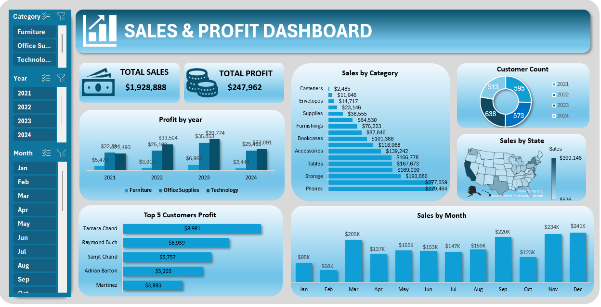

# 📊 Sales and Profit - Data Analysis  

This Power BI project analyzes sales and profit data across different categories, customers, and time periods. The dashboard provides key insights into sales performance, profitability, and customer trends, supporting data-driven business decisions.  

---

## 📷 Dashboard Preview  
  

---

## 🚀 Key Features  
- **KPI Cards**: Total Sales, Total Profit  
- **Profit by Year**: Yearly profit trends  
- **Sales by Sub-Category**: Product-level sales distribution  
- **Category Sales**: Comparative view of category performance  
- **Customer Count by Year**: Customer growth over time  
- **Sales by State**: Geographic sales performance  
- **Top 5 Customer Profit**: Highest profit-generating customers  
- **Sales by Month**: Monthly sales seasonality  

---

## 🎯 Slicers / Filters  
- Category  
- Year  
- Month  

These slicers enable dynamic exploration and drill-down for more detailed insights.  

---

## 🛠 Tools & Technologies  
- **Power BI Desktop**  
- **DAX (Data Analysis Expressions)**  
- **Power Query**  

---

